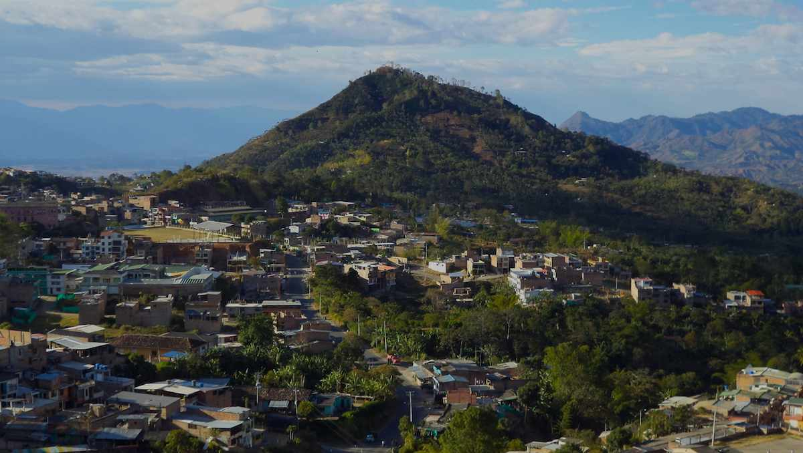
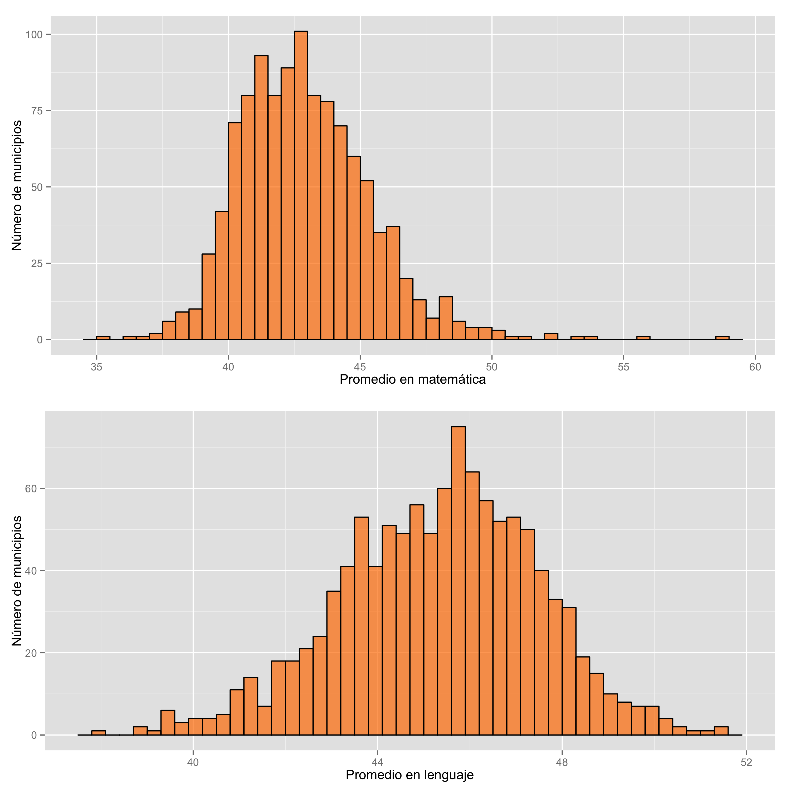
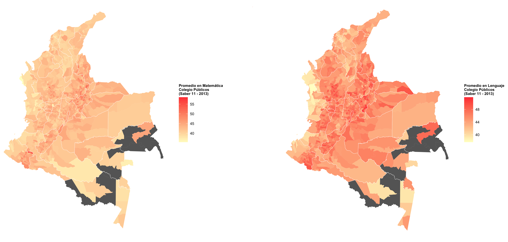
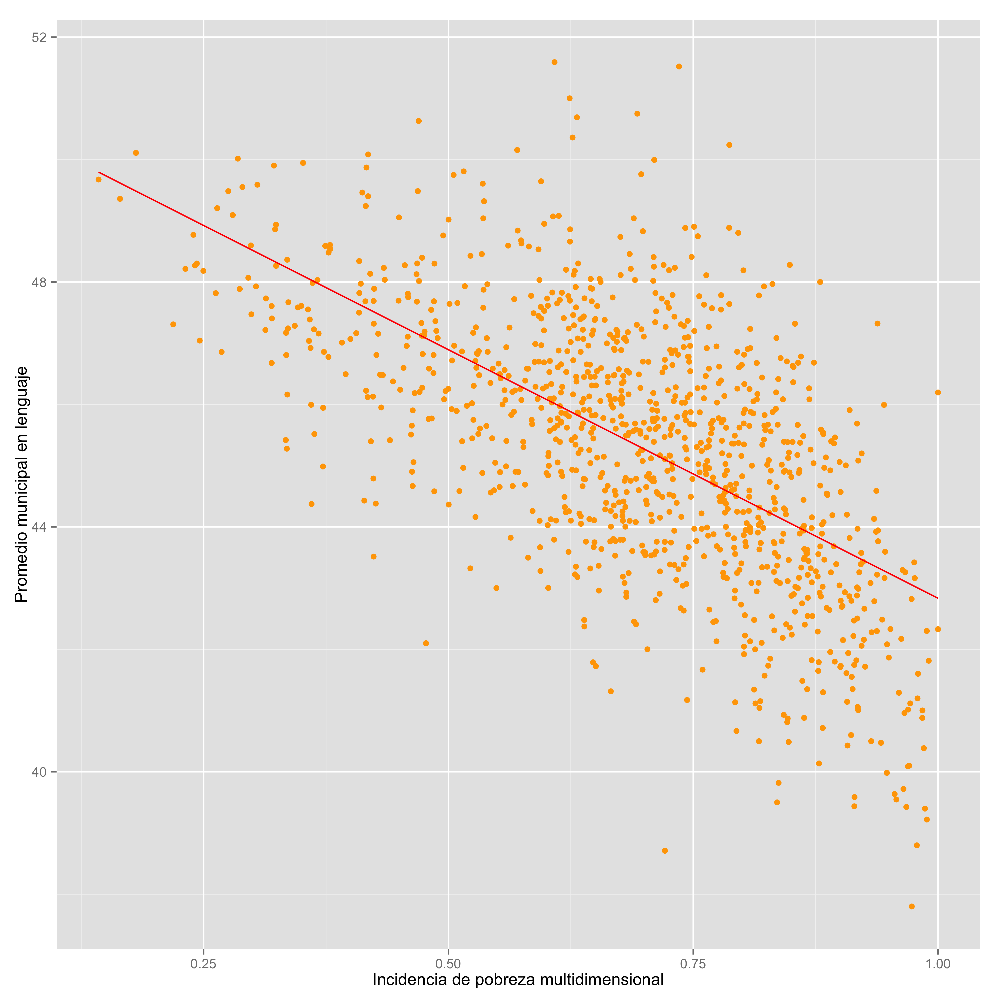
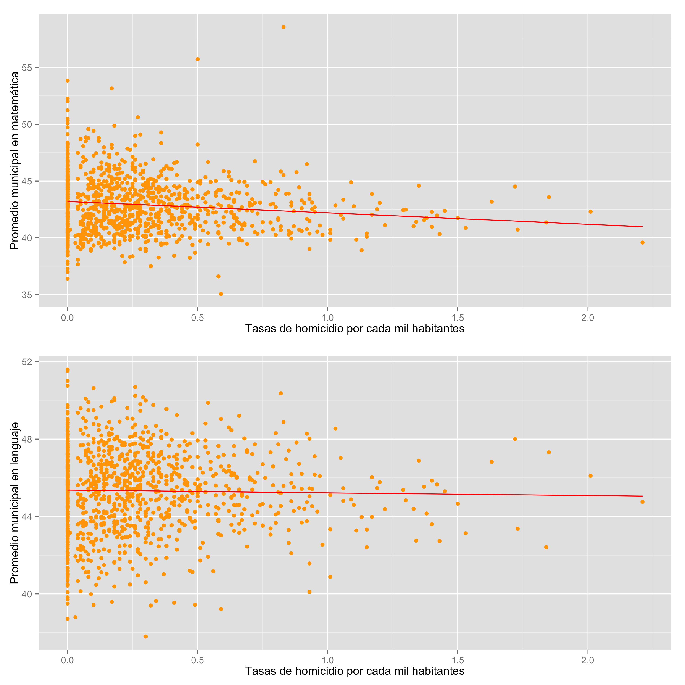
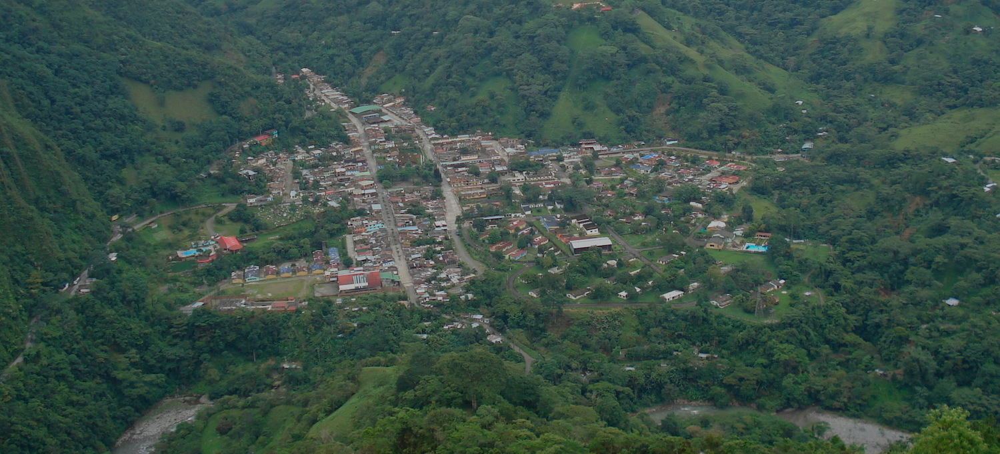

<nav class="navbar navbar-default navbar-static-top" role="navigation">
  

     <ul class="nav navbar-nav">
        <li><a href="#los_mas">Listas municipales</a></li>
        <li><a href="#departamentos">Lista departamental</a></li>
        <li><a href="#buscador_municipios">Busque su municipio</a></li>
      </ul>
      <ul class="nav navbar-nav navbar-right">
      	<li><a href="http://www.finiterank.com/notas/2014/02/12/12-2/">Explicación</a></li>
      </ul>
  

</nav>

<header>

<h1>Los más educados <small>Un sobrevuelo de Saber 11 (2013) a nivel municipal</small></h1>
</header>

	<small>Panorámica de <a href="http://www.launion-narino.gov.co/index.shtml">La Unión, Nariño</a>, el municipio con el mejor promedio en matemática en colegios públicos en 2013.
(Fuente: <a href="http://commons.wikimedia.org/wiki/File:Vista_de_la_union_nari%C3%B1o.JPG">Wikimedia Commons</a>)
</small>

Cada noviembre el ICFES publica <a href="http://www.icfes.gov.co/resultados/saber-11-resultados?id=39">los resultados de las pruebas Saber 11 a nivel de colegios</a>. Basados en esos resultados se divulgan en los medios listas de "los mejores colegios" y se reiteran en columnas de opinión los mismos lamentos sobre la calidad de la educación pública debido a su casi total ausencia en las listas de los primeros cien colegios (en una lista de cerca de doce mil). 

Hace un año largo escribí <a href="http://www.elespectador.com/opinion/columna-389967-saber-y-perder">una columna para <em>El Espectador</em></a> donde explicaba cómo <a href="http://nbviewer.ipython.org/url/finiterank.com/saber/saber.ipynb">un análisis estadístico sencillo</a> demuestra que en realidad los colegios públicos y los colegios privados en Colombia no se diferencian sustancialmente en cuanto a resultados en Saber. La lista de los mejores colegios está determinada, más que nada, por <a href="http://www.finiterank.com/notas/2013/12/19/19/">el nivel de ingresos</a> de las familias de sus estudiantes.

<h2 id="otra_lista">Una lista diferente: municipios y colegios públicos</h2>

En este pequeño reporte, basado en una idea de Jorge Orlando Melo (<a href="http://www.finiterank.com/notas/2014/02/12/12-2/">aquí explico más</a>), quiero concentrarme en los resultados de las pruebas Saber 11 del año 2013 a nivel municipal y restringirme, adicionamente, a los resultados en colegios públicos.
 

Una razón para justificar esta restricción es que la mayoría de los jóvenes colombianos estudian en colegios públicos. En 2013, el Icfes evaluó las competencias de 574.129 estudiantes de último grado de bachillerato. De estos, un 72,3% estudiaba en uno de los 8.338 colegios públicos del país. Otra razón es política: los colegios públicos son una de las principales herramientas de las entidades estatales para promover movilidad social y desarrollo. Su desempeño debería ser una preocupación permanente a todos los niveles del estado, empezando por los municipios.

<h2 id="numeros_y_letras">Números y letras</h2>

Adicionalmente, para simplificar, me enfoco en los resultados en matemática y lenguaje, las áreas centrales del núcleo educativo. <a href="https://docs.google.com/spreadsheet/ccc?key=0AnK0b1-vFIdcdGk2eDQyRmJGdkk4YnU0X0p5YkMzdVE&usp=sharing">Aquí</a> está la tabla resultante. En el gráfico a continuación presento las distribución de frecuencias para cada una de las dos áreas a nivel municipal:

Los resultados en matemática se concentran hacia la izquierda, en los puntajes bajos, y los de lenguaje hacia la derecha, en los puntajes más altos. Esto sugiere que a los estudiantes les va mejor en lenguaje que en matemática (o que la educación escolar en matemática está más desconectada del contenido de las pruebas). Así se ve esta disparidad cuando en un mapa se colorean los municipios de acuerdo a su puntaje en cada una de las dos areas (clic para agrandar):

<h2 id="los_mas">Los más</h2>

La pregunta obvia ante los mapas es cuáles son los municipios que se destacan por sus promedios altos en cada una de las dos áreas. ¿Hay algún patrón? ¿Puntos de acumulación? ¿Son municipios más ricos o más pequeños en general? No es tan claro. La que sigue es la tabla de los primeros  colegios en cada área:

<h3>Top 15 en matemática</h3>

<h3>Top 15 en lenguaje</h3>

<h2 id="detalles">Detalles</h2>

La lectura detallada de las listas genera nuevas preguntas: la mayoría de los primeros lugares son ocupados por municipios relativamente pequeños en Santander, Nariño, Antioquia y Boyacá. En las listas de los primeros cincuenta municipios sólo hay dos capitales: Tunja y Bucaramanga. Aunque están presentes varios de los municipios periféricos a ciudades grandes donde se encuentran las sedes de los colegios privados de élite como Envigado, Floridablanca y Cajicá (¿transferencia de maestros?), Bogotá ocupa la posición 73 en lenguaje y la 156 en matemática. Medellín por su parte alcanza la posición 81 en lenguaje y la 272 en matemática. ¿Tal vez hay una relación entre altos promedios municipales y bajo número de evaluados? La siguiente gráfica sugiere que la respuesta a esta pregunta es negativa:
 

¿Y qué hay de la pobreza? Tal vez los municipios que ocupan los primeros lugares tienen bajos niveles de pobreza. En la gráfica a continuación comparo <a href="https://www.dnp.gov.co/LinkClick.aspx?fileticket=lXf_K5Q1VZE%3D&tabid=337">la incidencia de pobreza multidimensional</a> (de acuerdo a cálculos de 2005) y el puntaje promedio en lenguaje:

En este caso hay una correlación más o menos clara: entre mayor es el índice de pobreza multidimensional (proporción de la población categorizada como pobre de acuerdo a una valoración de sus condiciones de vida (más que de su nivel de ingresos)) los resultados en el examen son menores. Esto, sin embargo, no es de sorprenderse: entre los factores que son considerados en la construcción del índice de pobreza multidimensional están el bajo logro educativo, el analfabetismo y la inasistencia y rezago escolar.

Por otro lado, no sobra señalar que los municipios que ocupan las primeras dos posiciones en lenguaje tienen incidencia de pobreza de 0,6 (Santa María, Boyacá) y 0,73 (San José de Miranda, Santander). La Unión, Nariño, el primero en matemática, tiene una incidencia de pobreza multidimensional de 0,74.

<h2 id="violencia">¡Violencia!</h2>

Varios de los primeros lectores de las tablas propusieron la hipótesis de que los buenos puntajes podrían estar correlacionados con bajos niveles de violencia. Para estudiar esta posibilidad comparé los resultados a nivel municipal en ambas áreas con la tasa de homicidio de 2013 (<a href="https://docs.google.com/spreadsheet/ccc?key=0AnK0b1-vFIdcdGdBZzNnM0ZST05FY2loaXhDWHBHemc&usp=sharing">aquí pueden descargarla</a>), un indicador burdo pero aceptable para medir incidencia de violencias.

La gráfica sugiere una ligerísima correlación negativa (estadísticamente insignificante en el caso de lenguaje, por cierto) entre la tasa de homicidio y el promedio municipal en el examen. Nada concluyente. Hay prácticamente la misma cantidad de malos y buenos puntajes a lo largo de todos los valores de la tasa de homicidios.

<h2 id="suerte">¿Suerte?</h2>

Por supuesto, siempre existe la posibilidad de que no haya patrón ni secreto del éxito y el alto promedio de un año sea simple cuestión de suerte. Para estudiar esta posibilidad tomemos los resultados de las pruebas Saber de 2011 y, de nuevo, restrinjámonos a los promedios de colegios públicos por municipio en matemática y lenguaje. <a href="https://docs.google.com/spreadsheet/ccc?key=0AnK0b1-vFIdcdHR1UjRLaFlTdXBkOGI1V0hlMG5GUWc&usp=sharing">Aquí está la tabla resultante</a> por si quieren jugar con ella.

En 2013 hay 56 municipios que están simultáneamente en el decil superior de matemática y el decil superior de lenguaje. Por casualidad, lo mismo es cierto al respecto de 2011. Hasta ahí todo bien: no es de sorprenderse que una proporción alta esté en ambas listas pues hay alta correlación entre los resultados de todas las áreas de las pruebas. Ahora la pregunta es qué tan parecidas son estas dos listas. Al intersectarlas descubrí que comparten veintidós municipios. Esto es: hay veintidós municipios que ocupan el primer decil en matemática y lenguaje tanto en 2011 como en 2013. ¿Y cuáles son?: San Jose de Miranda (Santander), Paicol (Huila), Malaga (Santander), San Gil (Santander), Charalá (Santander), Paipa (Boyacá), Envigado (Antioquia), Bucaramanga (Santander), Sogamoso (Boyacá), La Ceja (Antioquia), Duitama (Boyacá), Tunja (Boyacá), Barichara (Santander), Guachucal (Nariño), Floridablanca (Santander), Entrerrios (Antioquia), Chía (Cundinamarca), Chinacota (Norte de Santander), Aguada (Santander), Pamplona (Norte Santander), Ipiales (Nariño) y Pasto (Nariño).

Vuelven la preguntas: ¿Qué están haciendo bien? ¿Con qué ventajas cuentan? ¿Son modelos que se pueden imitar? ¿Cuál es el secreto de Tunja, Bucaramanga y Pasto?

(Por otro lado, junto a las regularidades que sugieren condiciones particulares sostenidas, también hay triunfos fugaces: La Unión, Nariño, primero en puntajes en matemática en 2013 quedó en la posición 448 en 2011.)

Otra pregunta: ¿Por qué cada año no se otorga un reconocimiento a los municipios con buenos resultados en sus colegios públicos? ¿Por qué no se presiona a las alcaldías para que se sientan responsables de los resultados que obtienen sus colegios?

Si este fuera un reportaje serio aquí (o tal vez antes, intercalado entre las notas) vendría una crónica de la visita a los colegios (¿o el colegio?) en San José de Miranda, Santander, o tal vez una conversación con los secretarios de educación de Paicol, Huila, Guachucal, Nariño, y Tunja, Boyacá. Ojalá que alguien se animara a hacer esa parte esencial de la tarea.

<header>

</header>

<small>Panorámica de <a href="http://santamaria-boyaca.gov.co/index.shtml">Santa María, Boyacá</a> (¿Han notado, por cierto, lo flagrantemente inútiles e innavegables que son la mayoría de los sitios web de los municipios?), el municipio con el mejor promedio en lenguaje en colegios públicos en 2013.
(Fuente: <a href="http://santamaria-boyaca.gov.co/index.shtml">Alcaldía de Santa María</a>)
</small>

<h2 id="buscador_municipios">Busque su municipio</h2>

Una forma de organizar la lista de municipios tomando en cuenta ambas áreas es calcular el promedio y usarlo como índice. Esta aproximación, sin embargo, requiere primero que los rangos de valores de ambas áreas sean los mismos, de lo contrario valores muy altos o muy bajos en un área como matemática (con un rango amplio) pueden pesar demasiado al promediarlos con los valores de lenguaje (que tiene un rango más angosto).

La siguiente tabla permite navegar la lista de acuerdo al orden de un promedio de puntajes normalizados (transformados para que ocupen el intervalo entre cero y uno). Al elegir un municipio puede ver la posición del municipio, sus puntajes en matemática y lenguaje, el número de estudiantes evaluados y también estos mismos valores para los cinco municipios por encima y por debajo del que eligió.

(La tabla completa está disponible para descarga <a href="https://docs.google.com/spreadsheet/ccc?key=0AnK0b1-vFIdcdGk2eDQyRmJGdkk4YnU0X0p5YkMzdVE&usp=sharing">acá</a>.)

<strong>Municipio:</strong> 

<h2 id="departamentos">Adenda: Departamentos</h2>

Para el gobernador ansioso, aquí está la tabla de promedios de matemática y lenguaje en colegios públicos por departamentos (ordenado por promedio de los puntajes normalizados):

